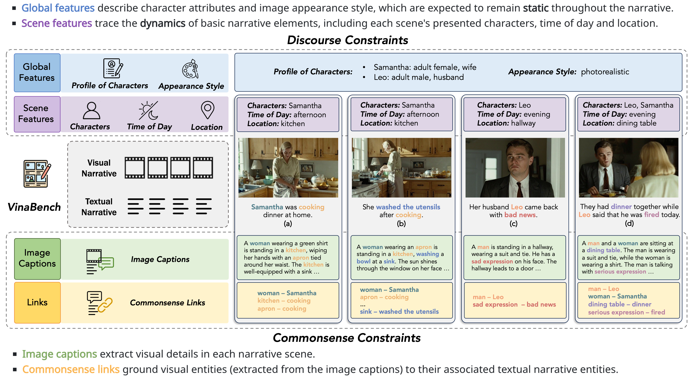

<div align="center">


# VinaBench: Benchmark for Faithful and Consistent Visual Narratives

</div>

<div align="center">
<b><a href="https://silin159.github.io/SilinGao/" target="_blank">Silin Gao</a><sup>1</sup>, <a href="http://multicomp.cs.cmu.edu/profile/sheryl-mathew/" target="_blank">Sheryl Mathew</a><sup>1,3</sup>, <a href="https://people.epfl.ch/li.mi?lang=en" target="_blank">Li Mi</a><sup>1</sup>, <a href="https://smamooler.github.io/" target="_blank">Sepideh Mamooler</a><sup>1</sup>, <a href="https://joemzhao.github.io/about.html" target="_blank">Mengjie Zhao</a><sup>2</sup>, <a href="https://www.linkedin.com/in/hiromi-wakaki-570067286/?originalSubdomain=jp" target="_blank">Hiromi Wakaki</a><sup>2</sup>, <a href="https://www.yukimitsufuji.com/" target="_blank">Yuki Mitsufuji</a><sup>2</sup>, <a href="https://smontariol.github.io/" target="_blank">Syrielle Montariol</a><sup>1</sup>, <a href="https://atcbosselut.github.io/" target="_blank">Antoine Bosselut</a><sup>1</sup></b>

<sup>1</sup>EPFL &nbsp; <sup>2</sup>Sony &nbsp; <sup>3</sup>CMU

[](https://silin159.github.io/Vina-Bench/)
[]()
[](https://huggingface.co/datasets/Silin1590/VinaBench)
</div>

## Abstract

<b>Visual narrative generation</b> transforms textual narratives into sequences of images illustrating the content of the text. However, generating visual narratives that are <b>faithful</b> to the input text and <b>self-consistent</b> across generated images remains an open challenge, due to the lack of knowledge constraints used for planning the stories. In this work, we propose a new benchmark, <b>VinaBench</b>, to address this challenge. Our benchmark annotates the underlying <b>commonsense and discourse constraints</b> in visual narrative samples, offering systematic scaffolds for learning the implicit strategies of visual storytelling. Based on the incorporated narrative constraints, we further propose <b>novel metrics</b> to closely evaluate the consistency of generated narrative images and the alignment of generations with the input textual narrative. Our results across three generative vision models demonstrate that learning with our VinaBench's knowledge constraints <b>effectively improves</b> the faithfulness and cohesion of generated visual narratives.

## Overview of VinaBench

<div align="center">

</div>

We augment existing visual-textual narrative pairs with discourse and commonsense constraints, to promote the learning of consistent and faithful visual narrative generation and its evaluation.
<!-- The <b>commonsense constraints</b> consist of links that ground the visual entities (extracted from image captions) to their associated textual narrative entities, as labeled by the phrases paired with the same color. The <b>discourse constraints</b> include scene-specific narrative features that trace the dynamics of basic narrative elements, i.e., characters, time and location, and global narrative features that describe static character attributes and image appearance style. -->

---

## Getting Started
VinaBench environments are developed based on Ubuntu 22.04, CUDA 12.1, Python 3.10 and Conda.

### Scripts for setting up environments:
```
# for training visual narrative baselines
bash setup_baseline.sh

# for Mantis-Idefics2
bash setup_mantis.sh

# for Llama-3.1-70B-Instruct
bash setup_llama.sh

# for Llama-OneVision-72B
bash setup_llava_onev.sh

# for MiniCPM-V-2.6
bash setup_minicpm.sh

# for training LLM narrative constraint generators
bash setup_torchtune.sh
```

## Preparing VinaBench Data
Please follow `data/README.md` to prepare the VinaBench data.

## VinaBench Baseline Training and Inference
We have tested three baseline models on VinaBench:
- [MM-Interleaved](https://arxiv.org/abs/2401.10208): please follow `MM-Interleaved/README.md`
- [AR-LDM](https://arxiv.org/abs/2211.10950): (coming soon)
- [StoryGen](https://arxiv.org/abs/2306.00973): (coming soon)

## VinaBench Evaluation
Please follow `evaluation/README.md` to perform VinaBench evaluation.

## Citation
```bibtex
@inproceedings{gao2025vinabench,
  title={VinaBench: Benchmark for Faithful and Consistent Visual Narratives},
  author={Gao, Silin and Mathew, Sheryl and Mi, Li and Mamooler, Sepideh and Zhao, Mengjie and Wakaki, Hiromi and Mitsufuji, Yuki and Montariol, Syrielle and Bosselut, Antoine},
  booktitle={Proceedings of the IEEE/CVF Conference on Computer Vision and Pattern Recognition},
  year={2025}
}
```
